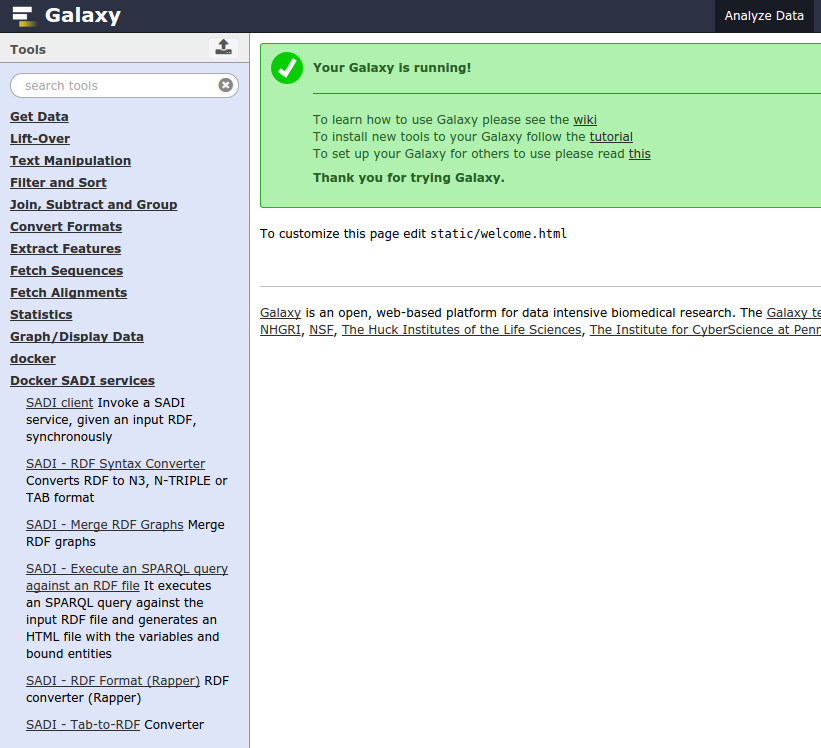
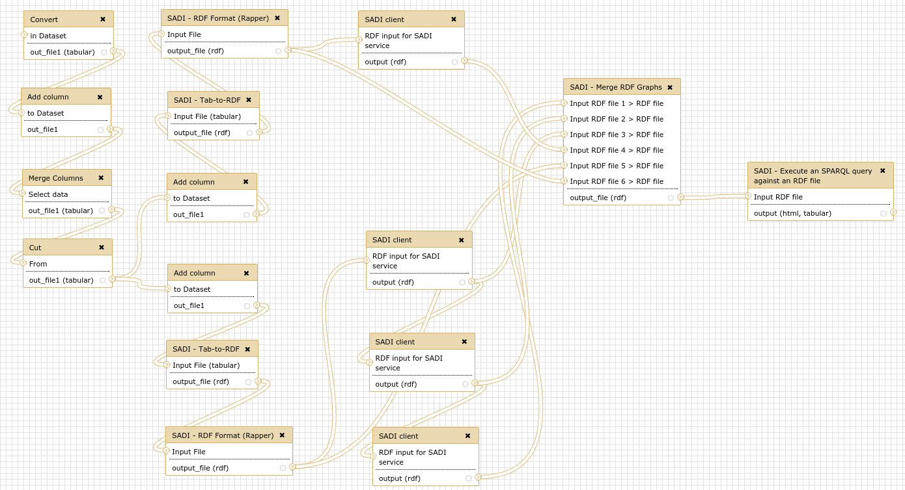

SADI-Docker for Galaxy
======================

[](https://zenodo.org/badge/latestdoi/39856817)

About
-----

[SADI](http://sadiframework.org/content/about-sadi/) is a framework to define Semantic Web Services that consume and produce [RDF](http://www.w3.org/standards/techs/rdf). On the other hand, [Docker](http://www.docker.com/whatisdocker/) is a container-based virtualisation environment for deploying applications very easily, without configuration or installation of dependencies. Therefore I have created SADI-Docker, a Docker image containing all the necessary programs and dependencies to invoke SADI services: Galaxy tool-files are also provided to execute such programs as regular Galaxy tools. Therefore, SADI can be used within Galaxy with a minimal installation (only the Docker image and the Galaxy XML files, see bellow). Even more, the SADI-Docker image can be used as a regular Docker image, runing it as a standalone Operating System pre-configured to invoke SADI services.

Mikel Egaña Aranguren, Mark D. Wilkinson. Enhanced reproducibility of SADI web service workflows with Galaxy and Docker. GigaScience 2015: 4(59). [DOI: 10.1186/s13742-015-0092-3][http://gigascience.biomedcentral.com/articles/10.1186/s13742-015-0092-3]

Installation
-----

Install Docker and do the thingy for avoiding sudo access: 

```
$ sudo apt-get install docker.io
$ sudo groupadd docker
$ sudo gpasswd -a your_user docker
$ sudo service docker.io restart
```

(You might need to log out and back in, and also I had to install apparmor).

Pull the [SADI-Docker image](https://hub.docker.com/r/mikeleganaaranguren/sadi/) to your Docker repository:

```
$ docker pull mikeleganaaranguren/sadi:v6
```

Check that it has been succesfully pulled:

```
$  docker images

REPOSITORY                 TAG                 IMAGE ID            CREATED             VIRTUAL SIZE
mikeleganaaranguren/sadi   v6                  0bb03066587d        46 hours ago        580.3 MB
```

Download/clone the latest Galaxy version:

```
$ git clone https://github.com/galaxyproject/galaxy.git
```

Download/clone this repository and copy the `tools/SADI-Docker` directory to the `tools` directory in your Galaxy installation. You can also install the Galaxy tools from within your Galaxy instance as regular Galaxy tools from the [Galaxy tool shed](https://toolshed.g2.bx.psu.edu/view/mikel-egana-aranguren/sadi_docker/54c48f9ca32b). There are five Galaxy tools:

* SADI-Docker-sadi_client: a SADI client for synchronous SADI services.
* SADI-Docker-RDFSyntaxConverter: a tool to convert between different RDF syntaxes, including from RDF to TSV files.
* SADI-Docker-mergeRDFgraphs: a tool to merge different RDF graphs into one.
* SADI-Docker-SPARQLGalaxy: a tool to perform SPARQL queries against RDF files.
* SADI-Docker-rapper: a tool to convert RDF files to different syntaxes.
* SADI-Docker-tab2rdf: a tool to produce RDF files from TSV files.

Add the following section to `config/tool_conf.xml` to add the tools to Galaxy (first copy `tool_conf.xml.sample` to `tool_conf.xml`):

```
    <section id="SADI-Docker" name="Docker SADI services">
		<tool file="SADI-Docker/SADI-Docker-sadi_client.xml"/>
		<tool file="SADI-Docker/SADI-Docker-RDFSyntaxConverter.xml"/>
		<tool file="SADI-Docker/SADI-Docker-mergeRDFgraphs.xml"/>
		<tool file="SADI-Docker/SADI-Docker-SPARQLGalaxy.xml"/>
		<tool file="SADI-Docker/SADI-Docker-rapper.xml"/>
		<tool file="SADI-Docker/SADI-Docker-tab2rdf.xml"/>
    </section>
```

Change the Galaxy configuration so that it can run Docker images as if they were regular tools installed in your system. Add a destination, `docker_local`, to your configuration, and make it the default. Copy `config/job_conf.xml.sample_basic` to `config/job_conf.xml` and add these lines to `config/job_conf.xml` (change `docker_memory` if necessary):

```
<?xml version="1.0"?>
<!-- A sample job config that explicitly configures job running the way it is configured by default (if there is no explicit config). -->
<job_conf>
    <plugins>
        <plugin id="local" type="runner" load="galaxy.jobs.runners.local:LocalJobRunner" workers="4"/>
    </plugins>
    <handlers>
        <handler id="main"/>
    </handlers>
    <destinations default="docker_local">
        <destination id="local" runner="local"/>
        <destination id="docker_local" runner="local">
            <param id="docker_enabled">true</param>
            <param id="docker_memory">6G</param>
            <param id="docker_sudo">false</param>
            <param id="docker_net">bridge</param>
        </destination>
    </destinations>
</job_conf>

```

(look at `job_conf.xml.sample_advanced` for more options regarding how Galaxy invokes Docker containers, since there are a lot of options).

Run Galaxy and the tools should appear under `Docker SADI services`:



Use case
------

In order to test the installation, you can run a pre-defined workflow. Upload the file `ẁorkflow/UniProt_IDs.txt` to your current Galaxy history. Then you can import the workflow in Galaxy (Workflows; Import or Upload Workflow; choose file `workflow/SADI-Docker_use_case.ga`). You can also find the workflow at the [tool shed](http://toolshed.g2.bx.psu.edu/view/mikel-egana-aranguren/sadi_docker_workflow/22be3a551998). Then run the workflow, choosing the UniProt_IDs.txt dataset as input for the first step.

The workflow answers the following question: Given a set of UniProt proteins, which ones are related to PubMed abstracts containing the term ``brain'', and what are they KEGG entries? The workflow starts from a simple list of UniProt identifiers, and retrieves different datasets from a regular SADI service (to obtain KEGG entries) and a set of 3 OpenLifeData2SADI services (to obtain PubMed abstracts). The results are then merged and queried to obtain the KEGG entries of proteins that are related to PubMed abstracts that contain the term. 



The SADI services used in the workflow are:

* http://sadiframework.org/services/getKEGGIDFromUniProt
* http://biordf.org/cgi-bin/SADI/OpenLifeData2SADI/SADI/hgnc/uniprot_vocabulary_Resource_hgnc_vocabulary_x-uniprot-inverse_hgnc_vocabulary_Resource
* http://biordf.org/cgi-bin/SADI/OpenLifeData2SADI/SADI/hgnc/hgnc_vocabulary_Resource_hgnc_vocabulary_x-omim_omim_vocabulary_Gene
* http://biordf.org/cgi-bin/SADI/OpenLifeData2SADI/SADI/omim/omim_vocabulary_Gene_omim_vocabulary_article_pubmed_vocabulary_PubMedRecord

And the SPARQL query to obtain the result:

```
PREFIX rdf: <http://www.w3.org/1999/02/22-rdf-syntax-ns#> 
PREFIX rdfs: <http://www.w3.org/2000/01/rdf-schema#>
PREFIX sadi: <http://sadiframework.org/ontologies/predicates.owl#>
PREFIX lsrn: <http://purl.oclc.org/SADI/LSRN/>

SELECT ?protein ?label ?KEGG
WHERE { 
    ?protein rdf:type lsrn:UniProt_Record . 
    ?protein sadi:isEncodedBy ?KEGG . 
    ?protein ?prot2hgnc ?hgnc . 
    ?hgnc ?hgnc2omim ?omim . 
    ?omim ?omim2pubmed ?pubmed . 
    ?pubmed rdfs:label ?label . 
    FILTER (regex (?label, 'brain'))
}
```

Notes
-----

* This project is a continuation of [SADI-Galaxy-Docker](http://github.com/mikel-egana-aranguren/SADI-Galaxy-Docker), with the inverse approach, hence the name: SADI-Galaxy-Docker was a complete Galaxy server, configured with SADI tools, within a Docker image; SADI-Docker is a Docker image with only SADI tools, and any Galaxy instance can invoke the image.

* Tab2rdf is a "fork" of the tool [tab2rdf](http://toolshed.g2.bx.psu.edu/view/sem4j/sparql_tools). This version adds option for the user to define no base URI, i.e. all the entities of the tab file have their own URI. 

* When using the SADI client on its own, the input dataset's datatypes must be edited, stating that the input is an RDF file.

* The docker image can also be built without pulling it, using the Dockerfile:

```
FROM ubuntu:14.04
MAINTAINER Mikel Egaña Aranguren <mikel.egana.aranguren@gmail.com>

# Install the necessary stuff with apt-get

RUN apt-get update && apt-get install -y wget python python-setuptools raptor2-utils libraptor2-0

# apt-get install python-rdflib is not working so use easy_install instead

RUN easy_install rdflib

# SADI does not like OpenJDK so install Java from http://www.duinsoft.nl/packages.php?t=en

RUN wget http://www.duinsoft.nl/pkg/pool/all/update-sun-jre.bin
RUN sh update-sun-jre.bin

RUN mkdir /sadi
COPY sadi_client.jar /sadi/
COPY RDFSyntaxConverter.jar /sadi/
COPY __init__.py /sadi/
COPY MergeRDFGraphs.py /sadi/ 
COPY tab2rdf.py /sadi/
COPY sparql.py /sadi/
RUN chmod a+x /sadi/*
ENV PATH $PATH:/sadi
```


